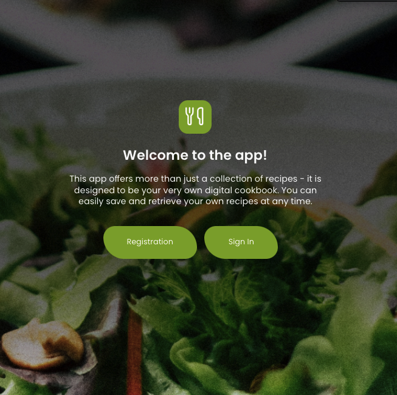
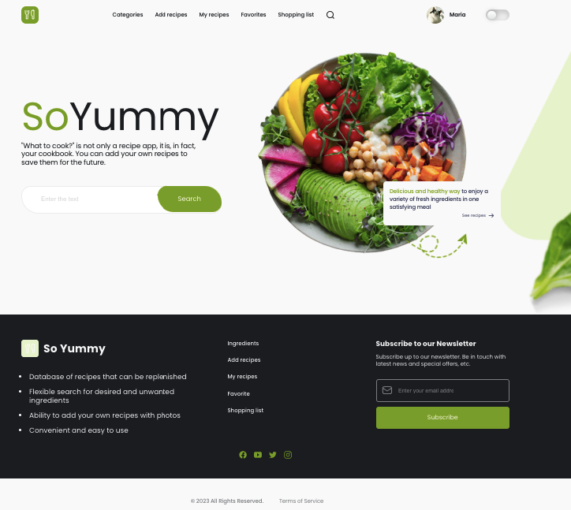

#  SoYummy App - your digital cookbook!

## Description:

SoYummy is a feature-rich single-page application (SPA). Fully responsive
design, oriented to any device (mobile, tablet, desktop). This app offers more
than just a collection of recipes - it is designed to be your very own digital
cookbook. You can easily save and retrieve your own recipes at any time. SoYummy
[Live page](https://marta7799.github.io/SoYummy/).

### Features:

- Registration and Login: user have the option to register and login (used:
  name, email, password)
- User have the option to choose/change his avatar and name
- Search for recipes by title, keywords or any ingredients
- For comfort, it is possible to choose a dark or light theme with the toggle on
  the menu
- Organization of recipes by categories, which makes it easier to find and
  navigate in the application on the `"Categories"` page
- The user has the opportunity to add his own recipes to the app on the
  `"Add recipes"`. With the help of the form, you can upload a photo of the
  recipe, quickly and conveniently choose the ingredients and make a description
  of the preparation of the dish. The added recipe will appear both on the
  `"My Recipes"` and in the general collection of recipes on the `"Categories"`
- The selected recipe page contains all the necessary information for its
  preparation. There is also an option to add/remove a recipe to favorites to
  return to the recipe later when needed on the `"Favorites"` page.
- Ability to create a shopping list based on selected recipes. The user can
  check the necessary ingredients and they will be available in the
  `"Shopping list"` page
- Possibility to `subscribe` to the newsletter of new recipes and news

## Technologies Used:

### FrontEnd:

- **HTML/CSS**
- **JavaScript**
- **Axios**
- **React**
- **React-router-dom**
- **ReduxToolkit**
- **React-select**
- **React-icons**
- **React-loader-spinner**
- **Emotion**
- **Formiks**
- **Yup**

### BackEnd

- **Node.js**
- **Express**
- **Mongoose**
- **Swagger**
- **Sendgrid**
- **Cloudinary**
- **Cors**
- **Jimp**
- **Joi**
- **Jsonwebtoken**
- **Morgan**
- **Multer**
